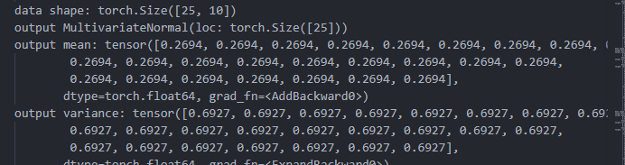

# Getting started

### Running locally

Some dependencies require  python to be below 3.11  
So use conda (or venv if u prefer):
```
conda create -n turbo-O python=3.10
conda activate turbo-O
pip install -r requirements.txt
```
And then just use the python notebooks to run whichever TuRBO version you like

# Turbo DKL: 

Current best of 0.0181 by Full DKL on dataset compared to 0.023 of TurboM.  
**TurboM average:** around 0.6 and 3.5 minutes  
**TurboDKL_full average:** around 0.6 and 6 minutes

Achieved by lowering to 12 initial epochs for the global/root model, then 8 epochs every 3 loops 
Full Dkl seems to be performing signicantly better than the NN DKL, however good runs are highly dependent on a good start. Also, seems to maker smaller more consistent and frequent steps than TurboM (especially if global model trains too much). Tweaking how frequently or long the global model updates only seems to worsen performance (both extremes for both variables)


## TODO:

- Assess whether [grid_variational_strategy](https://docs.gpytorch.ai/en/latest/variational.html#gridinterpolationvariationalstrategy) would allow true mixing between NN features and GP

- Assess whether this is the correct behaviour for the global GP model:

Same variance for each of 25 samples (and this is true for every epoch)  

- Take the UCB elements from TuRBO-O, but actually implement them correctly

### Note:

Full-kernel means the entire DKL model is used as a kernel by the TR gp's whereas the regular DKL (my first version) only used the DKL's gp's kernel as the kernel but then had the gp's inputs first be transformed by the NN. That latter version is clunky and not optimal, but I don't have the heart to delete it yet

### Previous Blockers: 
- Numerical instability of local TR gp's (covar not positive semi-definite)  
    - **Solution:** covar = covar * covar-transposed
- dtype error in dkl.  
    - **Solution:** Make sure all layers of dkl use torch.float64. Might have to rethink later, but that seems standard and I don't know of any 32bit pc systems
- Current feature_extraction layer's output is 1 dim, which is bad. But, it can't
be fixed atm because training requires the output of the gp layer be 1 dim mean 
because that's the dim of the target data, there then has to be 1 gp in the gp 
layer (if using multitask independent strategy) which then means that 
the feature_extraction layer has to output 1 dim as well.   
    - **Solution** for better use of gp: multiple nn features, but still 1 gp.

----------------
# Turbo O (Previous attempt)

### Description
New TR's go into unsampled space
Use UCB to pick which TR to train and GP-sample

For algorithm setup, use LHS to produce an abundance of spread out points on 
independent hyper-planes and then pull from those for each TR creation. This 
list of points can be seen as a  stack of regions because they wont be reused,
and LHS makes sure they're independent

### Current State:
Formula works. Best TR's are selected. They aren't updating though
Something is wrong with the idx's

## Notes and future:

We can use UCB to weigh candidates created in TuRBO-DKL so that selections can hopefully be more diverse. This is because TuRBO traditionally only samples points from the good TR, and it stops looking at others

# Other Experiment:

- Flipping turbo's growth behaviour:
    - **Result:** Slower due to more sampling in new spaces, and worse results
