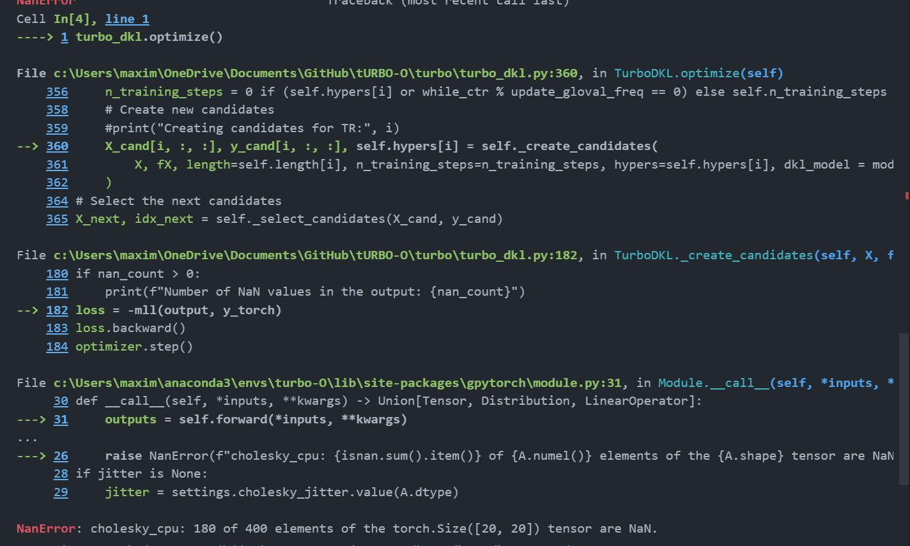
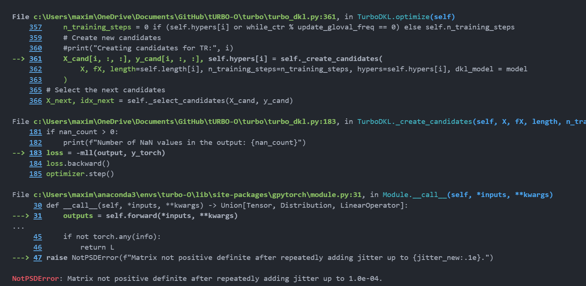

# Turbo DKL: #

Current best of 0.126 on dataset compared to 0.023 of TurboM.

## TODO:
Fix two bugs
- First happens in initial training/testing phase. 
Which is a result of numerical instability in potentially both hyperparameters and outputs. Possible solutions: increased jitter, and data normalization

- Second happens during the long term running when creating new candidates for a new gp. The gp creates some outputs but throws an error when calculating loss.

Apparently this means that the matrix in that gp is not positive semi-definite (PSD). Possible solutions: increased jitter, data normalization, and less aggressive learning rates.

Both bugs seem to be a result of the weirdness of my global-local kernel setup

### Previous Blockers: ###
dtype error in dkl. 
Solution: hardcode it to float32 for now

Current feature_extraction layer's output is 1 dim, which is bad. But, it can't
be fixed atm because training requires the output of the gp layer be 1 dim mean 
because that's the dim of the target data, there then has to be 1 gp in the gp 
layer (if using multitask independent strategy) which then means that 
the feature_extraction layer has to output 1 dim as well. 

Solution for better use of gp: multiple nn features, but still 1 gp.

----------------
Turbo O
New TR's go into unsampled space
Use UCB to pick which TR to train and GP-sample

Formula works. Best TR's are selected. They aren't updating though
Something is wrong with the idx's

-------
For algorithm setup, use LHS to produce an abundance of spread out points on 
independent hyper-planes and then pull from those for each TR creation. This 
list of points can be seen as a  stack of regions because they wont be reused,
 and LHS makes sure they're independent

 Try turbo flip behaviour: grow/shrinking in opposite behaviour of turbo
 Slower due to more sampling in new spaces, and worse results